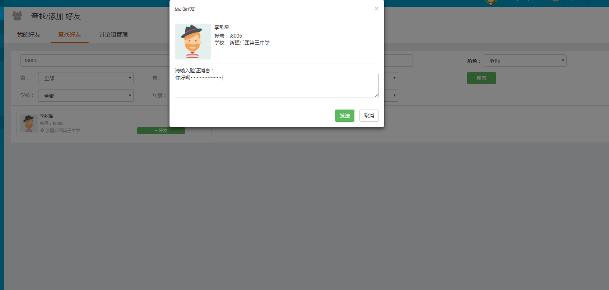
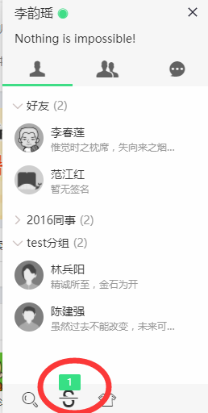
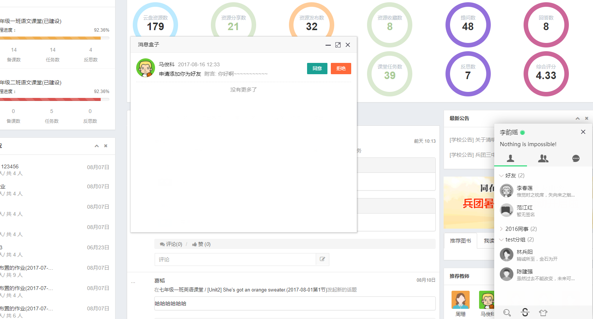

#JIM
基于websocket的即时通讯系统。
涉及技术：java、springMVC、mybatis、jquery、[layim](http://layim.layui.com/demo.html)、mongoDB等等。
##核心功能

### websocket的代码实现
前端[index.js](https://github.com/jkxqj/webChat/blob/master/index.js)
后端[LLWebSocket.java](https://github.com/jkxqj/webChat/blob/master/LLWebSocket.java)

### 操作mongo的工具类
[MongoUtils.java](https://github.com/jkxqj/webChat/blob/master/MongoUtils.java)

### 好友聊天存储、查询等等的服务
[FriendWS.java](https://github.com/jkxqj/webChat/blob/master/FriendWS.java)

### 群组相关服务
[QunWS.java](https://github.com/jkxqj/webChat/blob/master/QunWS.java)

### 图片和文件上传的服务
[FileUpload.java](https://github.com/jkxqj/webChat/blob/master/FileUpload.java)

###如果你有一定的java Web开发基础 根据本工程提供的核心代码即可开发出同样的功能。

如有疑问或者想探讨，欢迎在github给我提issues，同时欢迎star
 
#同时欢迎加我qq 1434262447 交流即时通讯和java 相关技术。
