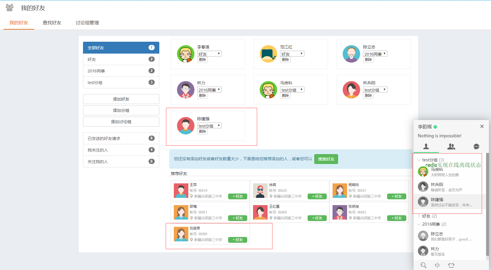
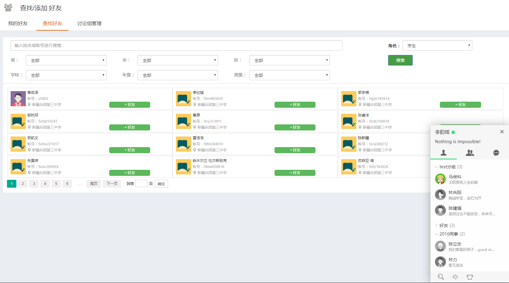
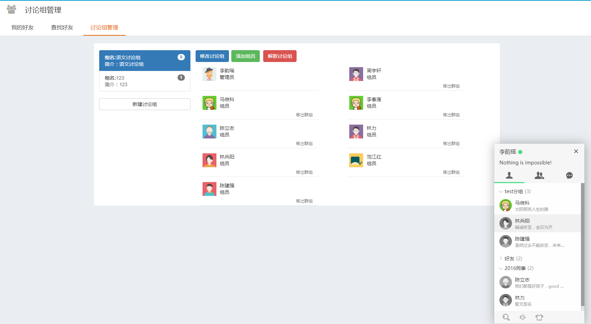
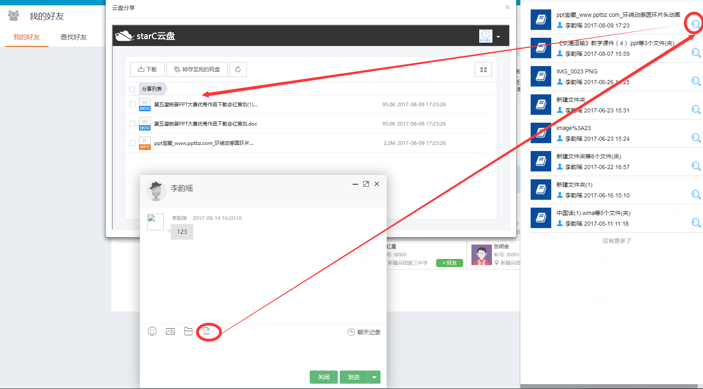
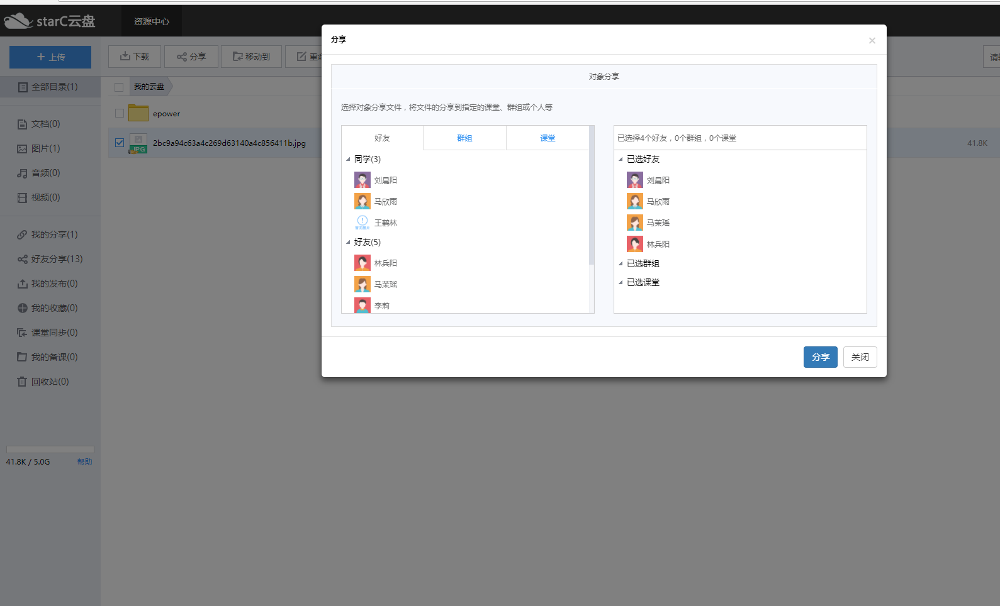
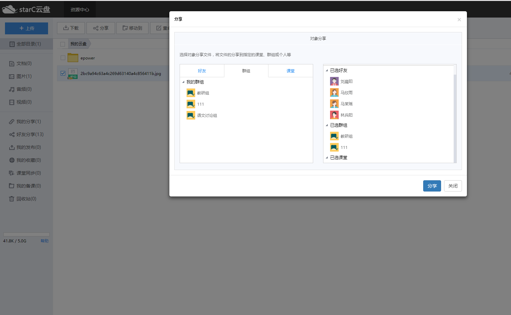
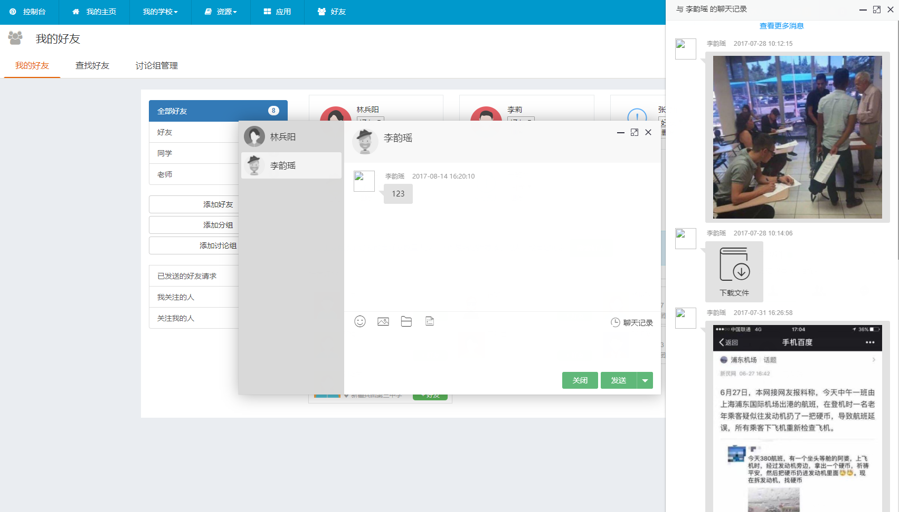

# KingIM
KingIM,基于websocket、netty、layim的即时通讯系统。
涉及技术：java、netty、springMVC、mybatis、jquery、[layim](http://layim.layui.com/demo.html)、redis、mysql等。

### 开源免费功能点
- [x] 单聊
- [x] 离线消息推送
- [x] 聊天发送文件和图片

---------------------
### KingIM付费版功能点
- [x] 群聊
- [x] 隐身
- [x] 修改签名
- [x] 查看聊天记录
- [x] 好友管理
- [x] 好友分组管理
- [x] 群组管理
- [x] 群成员管理
- [x] 好友搜索
- [x] 添加好友
- [x] 系统通知和提醒
- [x] 好友上线头像点亮下线头像置灰
- [x] 适配移动端页面

###  注意：
- 不论是付费版还是开源免费版都需要layim插件才能看到效果，找我购买更优惠。
- tomcat使用7.0,redis使用3.2默认安装即可不要设置密码，mysql使用5.6。
- layim前端插件需要获得授权，故没有上传，相关文件位置可以查看gitignore文件。
- 获得layim授权后，将所购买的layim文件夹直接覆盖本工程的layim文件夹。
- 请使用IntelliJ IDEA导入本maven工程，导入后选中resources文件夹右键选择mark directory as -> Resources Root。
- 运行前需准备好redis和mysql，mysql需要导入本工程的webchat.sql文件。

### 欢迎加我weixin(备注KingIM)购买付费版

下图均为付费版截图

